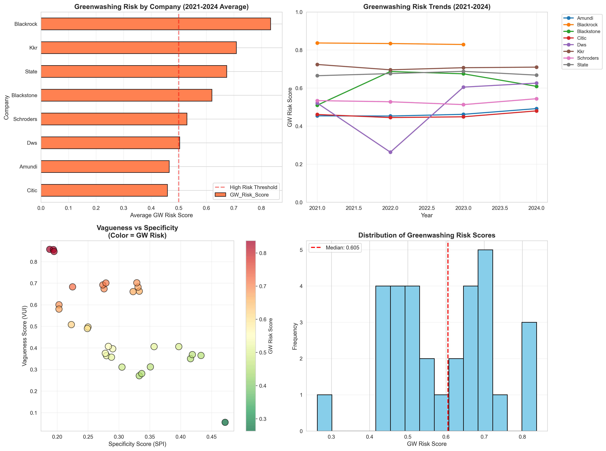
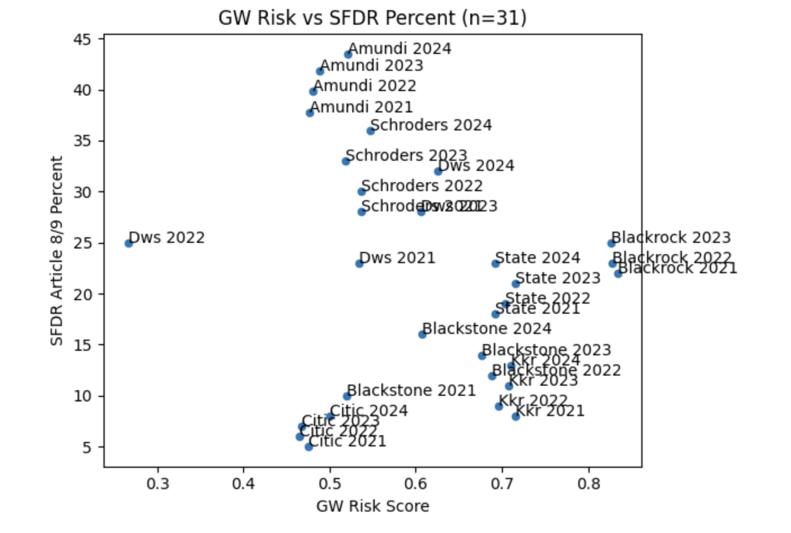
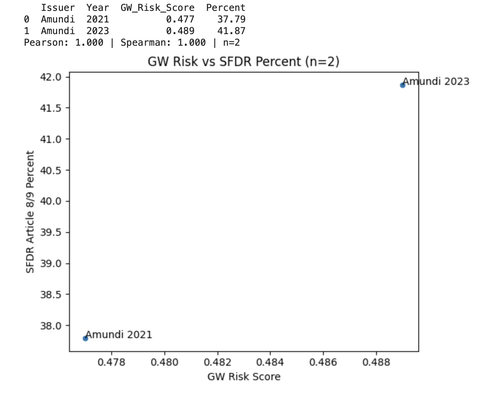
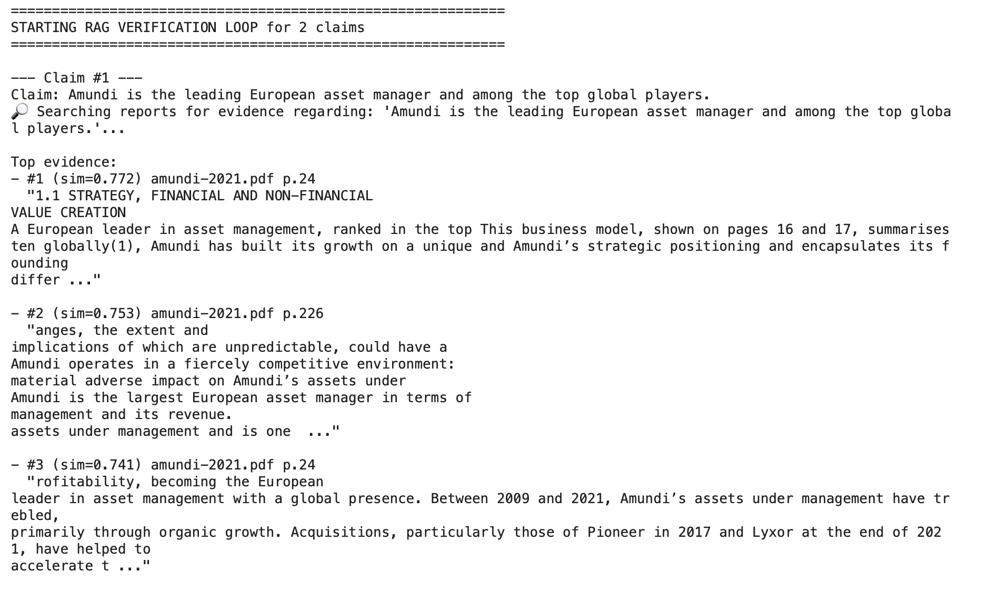

# Greenwashing Detection in Financial Reports

## Overview
This repository contains the code and resources for a Natural Language Processing (NLP) pipeline designed to quantify "greenwashing" risks in the annual reports of major asset managers. This project was developed as part of the "Applications of Data Science: LLMs" course at WU Vienna and serves as the foundational code for a Bachelor Thesis.

## Project Goal
The objective is to move beyond ESG metrics and audit the *narrative layer* of financial reports. The aim is to detect whether sustainability claims are specific, measurable, and time-bound, or vague and hedging.

## Methodology: The Hybrid Scoring System
The project utilizes a hybrid approach combining rule-based linguistic analysis with a fine-tuned Large Language Model (LLM).

The system calculates three key metrics:
1. **VUI (Vagueness Index):** A rule-based metric normalizing the frequency of hedging terms (e.g., "aim," "strive," "intend").
2. **SPI (Specificity Index):** A combination of rule-based regex matching (detecting numbers, units, and dates) and a Fine-Tuned DistilRoBERTa model classified to distinguish "Specific" claims from "Vague" ones.
3. **GW (Greenwashing Risk) Score:** An aggregated score where a lower value indicates better, more specific reporting.

The aggregation formula used is:
GW = 0.56 * VUI_norm + 0.44 * (1 - SPI_hybrid)

## Data Strategy
### 1. Synthetic Training Data
Due to the scarcity of labeled greenwashing datasets, we generated a synthetic dataset using GPT-4o for the initial training phase.
- **Class 0 (Vague):** Claims containing hedging words without concrete targets.
- **Class 1 (Specific):** Claims containing concrete numbers, dates, and measurable units.

*Note regarding Bachelor Thesis:* While this repository currently uses synthetic data for model training, the final thesis work involves replacing/augmenting this with a dataset annotated by human validators via Prolific to ensure rigorous ground-truth validation.

### 2. Inference Data
The model is applied to real-world annual reports (2021-2024) from major asset managers, including BlackRock, Amundi, DWS, and KKR.

## Repository Structure
- `notebooks/`: Contains the three-stage pipeline (Data Generation -> Fine-Tuning -> Analysis).
- `src/`: Helper scripts for PDF parsing, text cleaning, and scoring logic.
- `models/`: Directory for the fine-tuned DistilRoBERTa model.
- `inputs/`: Raw PDF reports and synthetic training CSVs.
- `outputs/`: Generated scores and visualizations.

## Key Results
The analysis reveals significant variation in reporting quality across issuers. Below is an example of the temporal analysis performed in Notebook 3.

## Primary Model Performance (DistilRoBERTa)
### Overview
We employed a **DistilRoBERTa-base** model fine-tuned on our synthetic dataset to classify claims as "Specific" or "Vague".

### Baseline Performance (Untrained)
Before training, the pre-trained DistilRoBERTa model essentially performed random guessing, highlighting the necessity of domain-specific fine-tuning.
- **Accuracy:** 0.5000 (50%)
- **Precision:** 0.5000
- **Recall:** 1.0000
- **F1-Score:** 0.6667

### Fine-Tuned Performance
After fine-tuning for 3 epochs on the synthetic dataset, the model learned to perfectly distinguish the linguistic patterns of specificity defined in our prompts.
- **Accuracy:** 1.0000 (100%)
- **Precision:** 1.0000
- **Recall:** 1.0000
- **F1-Score:** 1.0000

*Note on 100% Accuracy:* While typically indicative of overfitting, in this context, it confirms that the model successfully learned the distinct linguistic rules (Specific vs. Vague) encoded in the synthetic generation process.

## Model Comparison & Evaluation (Benchmarking)
### Overview
This stage evaluates and compares different model architectures to identify the most effective approach for greenwashing detection.

### FinBERT Fine-Tuning & Comparison
Test whether a domain-specific model (FinBERT, pre-trained on financial texts) outperforms the generic RoBERTa baseline.

#### Results:
**Baseline Performance (Untrained FinBERT):**
- Accuracy:  0.5400 (54%)
- Precision: 0.5312
- Recall:    0.5400
- F1-Score:  0.5289
*Conclusion: Pre-training alone is insufficient.*

**Fine-Tuned FinBERT:**
- Accuracy:  0.9600 (96%)
- Precision: 0.9615
- Recall:    0.9600
- F1-Score:  0.9604

**Key Achievement:**
- 42 percentage point improvement through fine-tuning (54% → 96%)
- 4% error rate on evaluation set (2 misclassifications out of 50)

## Zero-Shot LLM Evaluation

**Objective:**
Test whether large language models can perform greenwashing detection through prompting alone, without any task-specific training. This evaluates if model scale and general capabilities can substitute for fine-tuning.

### Model Configuration:
- **Model:** microsoft/phi-2 (2.7B parameters - 24x larger than FinBERT)
- **Approach:** Zero-shot prompting (no training)
- **Prompt:** System instructions with classification criteria

Evaluation: Same 50-sentence test set
Prompt Design:
System: "You are an expert in analyzing corporate sustainability reports. 
Classify statements as SPECIFIC (concrete numbers, dates, targets) 
or VAGUE (hedging words, no concrete commitments).
Respond with ONLY: SPECIFIC or VAGUE."

Input: "We reduced emissions by 50% by 2030."
Expected: "SPECIFIC"

### Results:
**Zero-Shot LLM Performance:**
- Accuracy:  0.8400 (84%)
- Precision: 0.8404
- Recall:    0.8400
- F1-Score:  0.8398

**Performance Gap:**
- Fine-tuned FinBERT: 96% accuracy
- Zero-shot Phi-2: 84% accuracy
- Difference: 12 percentage points (96% vs 84%)
- Error rate comparison: 4x higher (16% vs 4%)

## SFDR Comparison
This Notebook compares the Greenwashing Scores (from the previous analysis) to the actual percentage of sustainable assets this asset manager has under management.
First it uses 2 data points that were researched and found from official sources.
Then it uses 29 more data points that were researched and estimated by ChatGPT.

## RAG Setup
This Notebook loads the the text of the 31 PDFs (of the asset managers annual reports) and chunks it into smaller blocks. These Blocks are saved into a Vector Data Structure for easy retrieval and comparison. In the next Step you can check specific statements, whether they are supported by text in the PDFs and where.

## Chat RAG
This is an unfinished chat integration, where you can chat with the Bot and ask it stuff based on the RAG and it will show you where there is evidence for it in the files.

#### Simple Transformer Chatbot
If you just want to talk to a small Hugging Face model locally, a lightweight console chatbot is included:

1. Install dependencies (first run will download the model unless it is already cached):
   `pip install -r requirements.txt`
2. Start chatting (type `exit` to quit):
   `python simple_chatbot.py --model-id microsoft/Phi-3-mini-4k-instruct`

-> next step: connecting the chatbot with the RAG Chat

## Usage
1. Install requirements: `pip install -r requirements.txt`
2. Navigate to `notebooks/` and run the files in order:
   - `1_Data_Prep_Synthetic.ipynb`: Generates training data.
   - `2_Fine_Tuning_RoBERTa.ipynb`: Fine-tunes the classification model.
   - `3_Greenwashing_Analysis.ipynb`: Parses PDFs and calculates final scores.

## Authors
**Maxim Gomez Valverde** (GitHub: @builtbymaxim)
*Concept, Pipeline Development, Model Fine-Tuning (RoBERTa), Scoring Analysis, and Thesis Authorship.*

**Emanuel Zeder**
*SFDR Comparison, RAG Setup, Chatbot Integration.*

**Elias Gatterer**
*Model Comparison & Evaluation (FinBERT fine-tuning, Zero-Shot LLM testing, Comparative Analysis).*
